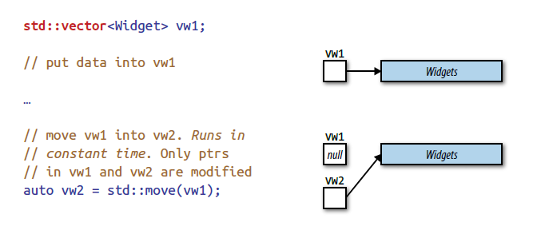
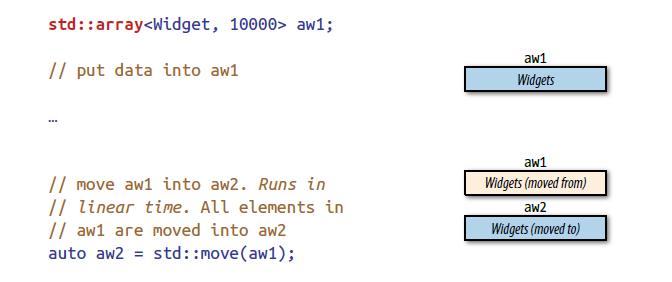

* 移动语义使编译器可以用开销较低的移动操作替换昂贵的拷贝操作（*但不是所有情况下移动都会比拷贝快*），是 move-only 类型对象的支持基础
* 完美转发可以将某个函数模板的实参转发给其他函数，转发后的实参保持完全相同的值类别（*左值、右值*）
* 右值引用是移动语义和完美转发的实现基础，它引入了一种新的引用符号（*&&*）来区别于左值引用
* 这些名词很直观，但概念上容易与名称类似的函数混淆
  * 移动操作的函数要求传入的实参是右值，无法传入左值，因此需要一个能把左值转换为右值的办法，这就是 [std::move](https://en.cppreference.com/w/cpp/utility/move) 做的事。[std::move](https://en.cppreference.com/w/cpp/utility/move) 本身不进行移动，只是将实参强制转换为右值，以允许把转换的结果传给移动函数
  * 完美转发指的是，将函数模板的实参转发给另一个函数，同时保持实参传入给模板时的值类型（*传入的实参是左值则转发后仍是左值，是右值则转发后仍是右值*）。如果不做任何处理的话，不论是传入的是左值还是右值，在传入之后都会变为左值，因此需要一个转换到右值的操作。[std::move](https://en.cppreference.com/w/cpp/utility/move) 可以做到这点，但它对任何类型都会一视同仁地转为右值。这就需要一个折衷的办法，对左值实参不处理，对右值实参（*传入后会变为左值*）转换为右值，这就是 [std::foward](https://en.cppreference.com/w/cpp/utility/forward) 所做的事
  * 如果要表示参数是右值，则需要引入一种区别于左值的符号，这就是右值引用符号（*&&*）。右值引用即只能绑定到右值的引用，但其本身是左值（*引用都是左值*）。它只是为了区别于左值引用符号（*&*）而引入的一种符号标记
  * 在模板中，带右值引用符号（*T&&*）并不表示一定是右值引用（*这种不确定类型的引用称为转发引用*），因为模板参数本身可以带引用符号（*int&*），此时为了使结果合法（*int& && 是不合法的*），就引入了引用折叠机制（*int& && 折叠为 int&*）

## 23 [std::move](https://en.cppreference.com/w/cpp/utility/move) 和 [std::forward](https://en.cppreference.com/w/cpp/utility/forward) 只是一种强制类型转换

* [std::move](https://en.cppreference.com/w/cpp/utility/move) 实现如下

```cpp
#include <cassert>
#include <string>
#include <type_traits>
#include <utility>

namespace jc {

template <typename T>
constexpr std::remove_reference_t<T>&& move(T&& x) noexcept {
  return static_cast<std::remove_reference_t<T>&&>(x);
}

constexpr int f(const std::string&) { return 1; }
constexpr int f(std::string&&) { return 2; }

}  // namespace jc

int main() {
  std::string s;
  static_assert(jc::f(s) == 1);
  assert(jc::f(std::string{}) == 2);
  static_assert(jc::f(static_cast<std::string&&>(s)) == 2);
  static_assert(jc::f(jc::move(s)) == 2);
  static_assert(jc::f(std::move(s)) == 2);
}
```

* [std::move](https://en.cppreference.com/w/cpp/utility/move) 会保留 cv 限定符

```cpp
#include <utility>

namespace jc {

constexpr int f(int&&) { return 1; }
constexpr int f(const int&) { return 2; }

}  // namespace jc

int main() {
  const int i = 1;
  static_assert(jc::f(std::move(i)) == 2);
}
```

* 这可能导致传入右值却执行拷贝操作

```cpp
#include <string>
#include <utility>

class A {
 public:
  /*
   * s 转为 const std::string&&
   * 调用 std::string(const std::string&)
   */
  explicit A(const std::string s) : s_(std::move(s)) {}

 private:
  std::string s_;
};
```

* 因此如果希望移动 [std::move](https://en.cppreference.com/w/cpp/utility/move) 生成的值，传给 [std::move](https://en.cppreference.com/w/cpp/utility/move) 的就不要是 const

```cpp
#include <string>
#include <utility>

class A {
 public:
  /*
   * s 转为 std::string&&
   * 调用 std::string(std::string&&)
   */
  explicit A(std::string s) : s_(std::move(s)) {}

 private:
  std::string s_;
};
```

* C++11 之前的转发很简单

```cpp
#include <iostream>

void f(int&) { std::cout << 1; }
void f(const int&) { std::cout << 2; }

// 用多个重载转发给对应版本比较繁琐
void g(int& x) { f(x); }

void g(const int& x) { f(x); }

// 同样的功能可以用一个模板替代
template <typename T>
void h(T& x) {
  f(x);
}

int main() {
  int a = 1;
  const int b = 1;

  g(a);
  h(a);  // 11
  g(b);
  h(b);  // 22
  g(1);  // 2
  // h(1);  // 错误
}
```

* C++11 引入了右值引用，但原有的模板无法转发右值。如果使用 [std::move](https://en.cppreference.com/w/cpp/utility/move) 则无法转发左值，因此为了方便引入了 [std::forward](https://en.cppreference.com/w/cpp/utility/forward)

```cpp
#include <iostream>
#include <utility>

void f(int&) { std::cout << 1; }
void f(const int&) { std::cout << 2; }
void f(int&&) { std::cout << 3; }

// 用多个重载转发给对应版本比较繁琐
void g(int& x) { f(x); }
void g(const int& x) { f(x); }
void g(int&& x) { f(std::move(x)); }

// 用一个模板来替代上述功能
template <typename T>
void h(T&& x) {
  f(std::forward<T>(x));
}

int main() {
  int a = 1;
  const int b = 1;

  g(a);
  h(a);  // 11
  g(b);
  h(b);  // 22
  g(std::move(a));
  h(std::move(a));  // 33
  g(1);
  h(1);  // 33
}
```

* 看起来完全可以用 [std::forward](https://en.cppreference.com/w/cpp/utility/forward) 取代 [std::move](https://en.cppreference.com/w/cpp/utility/move)，但 [std::move](https://en.cppreference.com/w/cpp/utility/move) 的优势在于清晰简单

```cpp
h(std::forward<int>(a));  // 3
h(std::move(a));          // 3
```

## 24 转发引用与右值引用的区别

* 带右值引用符号不一定就是右值引用，这种不确定类型的引用称为转发引用

```cpp
template <typename T>
void f(T&&) {}  // T&&不一定是右值引用

int a = 1;
f(a);  // T 推断为 int&，T&& 是 int& &&，折叠为 int&，是左值引用
f(1);  // T 推断为 int，T&& 是 int&&，右值引用
auto&& b = a;  // int& b = a，左值引用
auto&& c = 1;  // int&& c = 1，右值引用
```

* 转发引用必须严格按 T&& 的形式涉及类型推断

```cpp
template <typename T>
void f(std::vector<T>&&) {}  // 右值引用而非转发引用

std::vector<int> v;
f(v);  // 错误

template <typename T>
void g(const T&&) {}  // 右值引用而非转发引用

int i = 1;
g(i);  // 错误
```

* T&& 在模板中也可能不涉及类型推断

```cpp
template <class T, class Allocator = allocator<T>>
class vector {
 public:
  void push_back(T&& x);  // 右值引用

  template <class... Args>
  void emplace_back(Args&&... args);  // 转发引用
};

std::vector<A> v;  // 实例化指定了 T

// 对应的实例化为
class vector<A, allocator<A>> {
 public:
  void push_back(A&& x);  // 不涉及类型推断，右值引用

  template <class... Args>
  void emplace_back(Args&&... args);  // 转发引用
};
```

* auto&& 都是转发引用，因为一定涉及类型推断。完美转发中，如果想在转发前修改要转发的值，可以用 auto&& 存储结果，修改后再转发

```cpp
template <typename T>
void f(T x) {
  auto&& res = do_something(x);
  do_something_else(res);
  set(std::forward<decltype(res)>(res));
}
```

* lambda 中也可以使用完美转发

```cpp
auto f = [](auto&& x) { return g(std::forward<decltype(x)>(x)); };

// 转发任意数量实参
auto f = [](auto&&... args) {
  return g(std::forward<decltype(args)>(args)...);
};
```

## 25 对右值引用使用 [std::move](https://en.cppreference.com/w/cpp/utility/move)，对转发引用使用 [std::forward](https://en.cppreference.com/w/cpp/utility/forward)

* 右值引用只会绑定到可移动对象上，因此应该使用 [std::move](https://en.cppreference.com/w/cpp/utility/move)。转发引用用右值初始化时才是右值引用，因此应当使用 [std::forward](https://en.cppreference.com/w/cpp/utility/forward)

```cpp
class A {
 public:
  A(A&& rhs) : s_(std::move(rhs.s_)), p_(std::move(rhs.p_)) {}

  template <typename T>
  void f(T&& x) {
    s_ = std::forward<T>(x);
  }

 private:
  std::string s_;
  std::shared_ptr<int> p_;
};
```

* 如果希望只有在移动构造函数保证不抛异常时才能转为右值，则可以用 [std::move_if_noexcept](https://en.cppreference.com/w/cpp/utility/move_if_noexcept) 替代 [std::move](https://en.cppreference.com/w/cpp/utility/move)

```cpp
#include <iostream>
#include <type_traits>

struct A {
  A() = default;
  A(const A&) { std::cout << 1; }
  A(A&&) { std::cout << 2; }
};

struct B {
  B() {}
  B(const B&) noexcept { std::cout << 3; }
  B(B&&) noexcept { std::cout << 4; }
};

int main() {
  A a;
  A a2 = std::move_if_noexcept(a);  // 1
  B b;
  B b2 = std::move_if_noexcept(b);  // 4
}
```

* 如果返回对象传入时是右值引用或转发引用，在返回时要用 [std::move](https://en.cppreference.com/w/cpp/utility/move) 或 [std::forward](https://en.cppreference.com/w/cpp/utility/forward) 转换。返回类型不需要声明为引用，按值传递即可

```cpp
A f(A&& a) {
  do_something(a);
  return std::move(a);
}

template <typename T>
A g(T&& x) {
  do_something(x);
  return std::forward<T>(x);
}
```

* 返回局部变量时，不需要使用 [std::move](https://en.cppreference.com/w/cpp/utility/move) 来优化

```cpp
A make_a() {
  A a;
  return std::move(a);  // 画蛇添足
}
```

* 局部变量会直接创建在为返回值分配的内存上，从而避免拷贝，这是 C++ 标准诞生时就有的 [RVO（return value optimization）](https://en.cppreference.com/w/cpp/language/copy_elision)。RVO 的要求十分严谨，它要求局部对象类型与返回值类型相同，且返回的就是局部对象本身，而使用了 [std::move](https://en.cppreference.com/w/cpp/utility/move) 反而不满足 RVO 的要求。此外 RVO 只是种优化，编译器可以选择不采用，但标准规定，即使编译器不省略拷贝，返回对象也会被作为右值处理，所以 [std::move 是多余的](https://www.ibm.com/developerworks/community/blogs/5894415f-be62-4bc0-81c5-3956e82276f3/entry/RVO_V_S_std_move?lang=en)

```cpp
A make_a() { return A{}; }

auto x = make_a();  // 只需要调用一次 A 的默认构造函数
```

## 26 避免重载使用转发引用的函数

* 如果函数参数接受左值引用，则传入右值时执行的仍是拷贝

```cpp
#include <string>
#include <vector>

std::vector<std::string> v;

void f(const std::string& s) { v.emplace_back(s); }

int main() {
  // 传入右值，执行的依然是拷贝
  f(std::string{"hi"});
  f("hi");
}
```

* 让函数接受转发引用即可解决此问题

```cpp
#include <string>
#include <utility>
#include <vector>

std::vector<std::string> v;

template <typename T>
void f(T&& s) {
  v.emplace_back(std::forward<T>(s));
}

int main() {
  // 现在传入右值时变为移动操作
  f(std::string{"hi"});
  f("hi");
}
```

* 但如果重载这个转发引用版本的函数，就会导致新的问题

```cpp
#include <string>
#include <utility>
#include <vector>

std::vector<std::string> v;

template <typename T>
void f(T&& s) {
  v.emplace_back(std::forward<T>(s));
}

std::string make_string(int n) { return std::string("hi"); }

void f(int n) { v.emplace_back(make_string(n)); }

int main() {
  // 之前的调用仍然正常
  f(std::string{"hi"});
  f("hi");
  // 对于重载版本的调用也没问题
  f(1);  // 调用重载版本
  // 但对于非 int（即使能转换到 int）参数就会出现问题
  int i = 1;
  /*
   * 转发引用是比 int 更精确的匹配
   * 为 std::vector<std::string> 传入 short
   * 用 short 构造 std::string 导致错误
   */
  f(i);
}
```

* 转发引用几乎可以匹配任何类型，因此应该避免对其重载。此外，如果在构造函数中使用转发引用，会导致拷贝构造函数不能被正确匹配

```cpp
#include <string>
#include <utility>

std::string make_string(int n) { return std::string{"hi"}; }

class A {
 public:
  A() = default;

  template <typename T>
  explicit A(T&& x) : s_(std::forward<T>(x)) {}

  explicit A(int x) : s_(make_string(x)) {}

 private:
  std::string s_;
};

int main() {
  int i = 1;
  A a{i};     // 依然调用模板而出错，但还有一个更大的问题
  A b{"hi"};  // OK
  A c{b};  // 错误：调用的仍是模板，用 A 初始化 std::string 出错
}
```

* 模板构造函数不会阻止合成拷贝和移动构造函数（会阻止合成默认构造函数），上述问题的实际情况如下

```cpp
#include <string>
#include <utility>

class A {
 public:
  template <typename T>
  explicit A(T&& x) : s_(std::forward<T>(x)) {}

  A(const A& rhs) = default;
  A(A&& rhs) = default;

 private:
  std::string s_;
};

int main() {
  A a{"hi"};  // OK
  A b{a};  // 错误：T&& 比 const A& 更匹配，调用模板用 A 初始化 std::string 出错
  const A c{"hi"};
  A d{c};  // OK
}
```

* 上述问题在继承中会变得更为复杂，如果派生类的拷贝和移动操作调用基类的构造函数，同样会匹配到使用了转发引用的模板，从而导致编译错误

```cpp
#include <string>
#include <utility>

class A {
 public:
  template <typename T>
  explicit A(T&& n) : s(std::forward<T>(n)) {}

 private:
  std::string s;
};

class B : public A {
 public:
  /*
   * 错误：调用基类模板而非拷贝构造函数
   * const B 不能转为 std::string
   */
  B(const B& rhs) : A(rhs) {}

  /*
   * 错误：调用基类模板而非移动构造函数
   * B 不能转为 std::string
   */
  B(B&& rhs) noexcept : A(std::move(rhs)) {}
};
```

## 27 重载转发引用的替代方案

* 上述问题的最直接解决方案是，不使用重载。其次是使用 C++98 的做法，不使用转发引用

```cpp
#include <string>

class A {
 public:
  template <typename T>
  explicit A(const T& x) : s_(x) {}

 private:
  std::string s_;
};

int main() {
  A a{"hi"};
  A b{a};  // OK
}
```

* 直接按值传递也是一种简单的方式，而且解决了之前的问题

```cpp
#include <string>
#include <utility>

std::string make_string(int n) { return std::string{"hi"}; }

class A {
 public:
  explicit A(std::string s) : s_(std::move(s)) {}
  explicit A(int n) : s_(make_string(n)) {}

 private:
  std::string s_;
};

int main() {
  int i = 1;
  A a{i};  // OK，调用 int 版本的构造函数
}
```

* 不过上述方法实际上是规避了使用转发引用，下面是几种允许转发引用的重载方法

### 标签分派（tag dispatching）

* 标签分派的思路是，额外引入一个参数来打破转发引用的万能匹配

```cpp
#include <string>
#include <type_traits>
#include <utility>
#include <vector>

std::vector<std::string> v;

template <typename T>
void g(T&& s, std::false_type) {
  v.emplace_back(std::forward<T>(s));
}

std::string make_string(int n) { return std::string{"hi"}; }

void g(int n, std::true_type) { v.emplace_back(make_string(n)); }

template <typename T>
void f(T&& s) {
  g(std::forward<T>(s), std::is_integral<std::remove_reference_t<T>>());
}

int main() {
  int i = 1;
  f(i);  // OK：调用 int 版本
}
```

### 使用 [std::enable_if](https://en.cppreference.com/w/cpp/types/enable_if) 在特定条件下禁用模板

* 标签分派用在构造函数上不太方便，这时可以使用 [std::enable_if](https://en.cppreference.com/w/cpp/types/enable_if) 强制编译器在不满足条件时禁用模板

```cpp
#include <string>
#include <type_traits>

class A {
 public:
  template <typename T,
            typename = std::enable_if_t<!std::is_same_v<A, std::decay_t<T>>>>
  explicit A(T&& x) {}

 private:
  std::string s_;
};
```

* 但这只是在参数具有和类相同的类型时禁用模板，派生类调用基类的构造函数时，派生类和基类也是不同类型，不会禁用模板，因此还需要使用 [std::is_base_of](https://en.cppreference.com/w/cpp/types/is_base_of)

```cpp
#include <string>
#include <type_traits>
#include <utility>

class A {
 public:
  template <typename T,
            typename = std::enable_if_t<!std::is_base_of_v<A, std::decay_t<T>>>>
  explicit A(T&& x) {}

 private:
  std::string s_;
};

class B : public A {
 public:
  B(const B& rhs) : A(rhs) {}                 // OK：不再调用模板
  B(B&& rhs) : A(std::move(rhs)) noexcept {}  // OK：不再调用模板
};
```

* 接着在参数为整型时禁用模板，即可解决之前的所有问题。为了更方便调试，可以用 [static_assert](https://en.cppreference.com/w/c/error/static_assert) 预设错误信息，这个错误信息将在不满足预设条件时出现在诊断信息中

```cpp
#include <string>
#include <type_traits>
#include <utility>

std::string make_string(int n) { return std::string{"hi"}; }

class A {
 public:
  template <typename T, typename = std::enable_if_t<
                            !std::is_base_of_v<A, std::decay_t<T>> &&
                            !std::is_integral_v<std::remove_reference_t<T>>>>
  explicit A(T&& x) : s_(std::forward<T>(x)) {
    static_assert(std::is_constructible_v<std::string, T>,
                  "Parameter n can't be used to construct a std::string");
  }

  explicit A(int n) : s_(make_string(n)) {}

 private:
  std::string s_;
};

int main() {
  int i = 1;
  A a{1};     // OK：调用 int 版本的构造函数
  A b{"hi"};  // OK
  A c{b};     // OK
}
```

## 28 引用折叠

* 引用折叠会出现在四种语境中：模板实例化、auto 类型推断、decltype 类型推断、typedef 或 using 别名声明
* 引用的引用是非法的

```cpp
int a = 1;
int&& b = a;  // 错误
```

* 当左值传给接受转发引用的模板时，模板参数就会推断为引用的引用

```cpp
template <typename T>
void f(T&&);

int i = 1;
f(i);  // T 为 int&，T& && 变成了引用的引用，于是需要引用折叠的机制
```

* 为了使实例化成功，编译器生成引用的引用时，将使用引用折叠的机制，规则如下

```
& + & → &
& + && → &
&& + & → &
&& + && → &&
```

* 引用折叠是 [std::forward](https://en.cppreference.com/w/cpp/utility/forward) 的支持基础

```cpp
#include <type_traits>

namespace jc {

// 如果传递左值 A，T 推断为 A&，此时需要引用折叠
template <typename T>
constexpr T&& forward(std::remove_reference_t<T>& t) noexcept {
  return static_cast<T&&>(t);
}

/*
 * 传递左值 A 时相当于
 * A&&& forward(std::remove_reference_t<A&>& x) { return static_cast<A&&&>(x); }
 * 简化后为
 * A& forward(A& x) { return static_cast<A&>(x); }
 * 传递右值 A 相当于
 * A&& forward(std::remove_reference_t<A>& x) { return static_cast<A&&>(x); }
 * 简化后为
 * A&& forward(A& x) { return static_cast<A&&>(x); }
 */

}  // namespace jc
```

* auto&& 与使用转发引用的模板原理一样

```cpp
int a = 1;
auto&& b = a;  // a 是左值，auto 被推断为 int&，int& && 折叠为 int&
```

* decltype 同理，如果推断中出现了引用的引用，就会发生引用折叠
* 如果在 typedef 的创建或求值中出现了引用的引用，就会发生引用折叠

```cpp
template <typename T>
struct A {
  using RvalueRef = T&&;  // typedef T&& RvalueRef
};

int a = 1;
A<int&>::RvalueRef b = a;  // int& && 折叠为 int&，int& b = a
```

* 并且 top-level cv 限定符会被丢弃

```cpp
using A = const int&;  // low-level
using B = int&&;       // low-level
static_assert(std::is_same_v<volatile A&&, const int&>);
static_assert(std::is_same_v<const B&&, int&&>);
```

## 29 移动不比拷贝快的情况

* 在如下场景中，C++11 的移动语义没有优势
  * 无移动操作：待移动对象不提供移动操作，移动请求将变为拷贝请求
  * 移动不比拷贝快：待移动对象虽然有移动操作，但不比拷贝操作快
  * 移动不可用：本可以移动时，要求移动操作不能抛异常，但未加上 noexcept 声明
* 除了上述情况，还有一些特殊场景无需使用移动语义，比如之前提到的 [RVO](https://en.cppreference.com/w/cpp/language/copy_elision)
* 移动不一定比拷贝代价小得多。比如 [std::array](https://en.cppreference.com/w/cpp/container/array) 实际是带 STL 接口的内置数组。不同于其他容器的是，其他容器把元素存放于堆上，自身只持有一个指向堆内存的指针，移动容器时只需要移动指针，在常数时间内即可完成移动



* [std::array](https://en.cppreference.com/w/cpp/container/array) 自身存储了内容，没有这样的指针，移动或拷贝对元素逐个执行，需要线性时间复杂度，所以移动并不比拷贝快多少



* 另一个移动不一定比拷贝快的例子是 [std::string](https://en.cppreference.com/w/cpp/string/basic_string)，一种实现是使用 [SSO（small string optimization）](https://blogs.msmvps.com/gdicanio/2016/11/17/the-small-string-optimization/)，在字符串很小时（一般是 15 字节）存储在自身内部，而不使用堆上分配的内存，因此对小型字符串的移动并不比拷贝快

## 30 无法完美转发的类型

* 用相同实参调用原函数和转发函数，如果两者执行不同的操作，则称完美转发失败。完美转发失败源于模板类型推断不符合预期，会导致这个问题的类型包括：大括号初始化值、作为空指针的 0 和 NULL、只声明但未定义的整型 static const 数据成员、重载函数的名称和函数模板名称、位域

### 大括号初始化

```cpp
void f(const std::vector<int>& v) {}

template <typename T>
void fwd(T&& x) {
  f(std::forward<T>(x));
}

f({1, 2, 3});    // OK，{1, 2, 3} 隐式转换为 std::vector<int>
fwd({1, 2, 3});  // 无法推断 T，导致编译错误

// 解决方法是借用 auto 推断出 std::initializer_list 类型再转发
auto x = {1, 2, 3};
fwd(x);  // OK
```

### 作为空指针的 0 或 NULL

* 0 和 NULL 作为空指针传递给模板时，会推断为 int 而非指针类型

```cpp
void f(int*) {}

template <typename T>
void fwd(T&& x) {
  f(std::forward<T>(x));
}

fwd(NULL);  // T 推断为 int，转发失败
```


### 只声明但未定义的 static const 整型数据成员

* 类内的 static 成员的声明不是定义，如果 static 成员声明为 const，则编译器会为这些成员值执行 const propagation，从而不需要为它们保留内存。对整型 static const 成员取址可以通过编译，但会导致链接期的错误。转发引用也是引用，在编译器生成的机器代码中，引用一般会被当成指针处理。程序的二进制代码中，从硬件角度看，指针和引用的本质相同

```cpp
class A {
 public:
  static const int n = 1;  // 仅声明
};

void f(int) {}

template <typename T>
void fwd(T&& x) {
  f(std::forward<T>(x));
}

f(A::n);    // OK：等价于 f(1)
fwd(A::n);  // 错误：fwd 形参是转发引用，需要取址，无法链接
```

* 但并非所有编译器的实现都有此要求，上述代码可能可以链接。考虑到移植性，最好还是提供定义

```cpp
// A.h
class A {
 public:
  static const int n = 1;
};

// A.cpp
const int A::n;
```

### 重载函数的名称和函数模板名称

* 如果转发的是函数指针，可以直接将函数名作为参数，函数名会转换为函数指针

```cpp
void g(int) {}

void f(void (*pf)(int)) {}

template <typename T>
void fwd(T&& x) {
  f(std::forward<T>(x));
}

f(g);    // OK
fwd(g);  // OK
```

* 但如果要转发的函数名对应多个重载函数，则无法转发，因为模板无法从单独的函数名推断出函数类型

```cpp
void g(int) {}
void g(int, int) {}

void f(void (*)(int)) {}

template <typename T>
void fwd(T&& x) {
  f(std::forward<T>(x));
}

f(g);    // OK
fwd(g);  // 错误：不知道转发的是哪一个函数指针
```

* 转发函数模板名称也会出现同样的问题，因为函数模板可以看成一批重载函数

```cpp
template <typename T>
void g(T x) {
  std::cout << x;
}

void f(void (*pf)(int)) { pf(1); }

template <typename T>
void fwd(T&& x) {
  f(std::forward<T>(x));
}

f(g);         // OK
fwd(g<int>);  // 错误
```

* 要让转发函数接受重载函数名称或模板名称，只能手动指定需要转发的重载版本或模板实例。不过完美转发本来就是为了接受任何实参类型，而要传入的函数指针类型一般是未知的

```cpp
template <typename T>
void g(T x) {
  std::cout << x;
}

void f(void (*pf)(int)) { pf(1); }

template <typename T>
void fwd(T&& x) {
  f(std::forward<T>(x));
}

using PF = void (*)(int);
PF p = g;
fwd(p);                   // OK
fwd(static_cast<PF>(g));  // OK
```

### 位域

* 转发引用也是引用，实际上需要取址，但位域不允许直接取址

```cpp
struct A {
  int a : 1;
  int b : 1;
};

void f(int) {}

template <typename T>
void fwd(T&& x) {
  f(std::forward<T>(x));
}

A x{};
f(x.a);    // OK
fwd(x.a);  // 错误
```

* 实际上接受位域实参的函数也只能收到位域值的拷贝，因此不需要使用完美转发，换用传值或传 const 引用即可。完美转发中也可以通过强制转换解决此问题，虽然转换的结果是一个临时对象的拷贝而非原有对象，但位域本来就无法做到真正的完美转发

```cpp
fwd(static_cast<int>(x.a));  // OK
```
