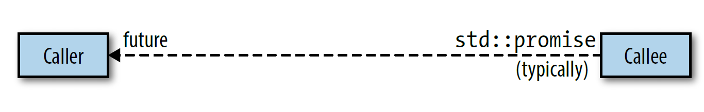
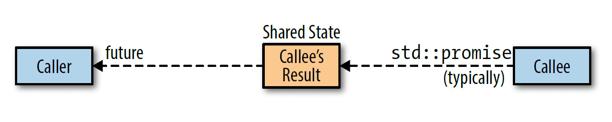

## 35 用 [std::async](https://en.cppreference.com/w/cpp/thread/async) 替代 [std::thread](https://en.cppreference.com/w/cpp/thread/thread)

* 异步运行函数的一种选择是，创建一个 [std::thread](https://en.cppreference.com/w/cpp/thread/thread) 来运行

```cpp
int f();
std::thread t{f};
```

* 另一种方法是使用 [std::async](https://en.cppreference.com/w/cpp/thread/async)，它返回一个持有计算结果的 [std::future](https://en.cppreference.com/w/cpp/thread/future)

```cpp
int f();
std::future<int> ft = std::async(f);
```

* 如果函数有返回值，[std::thread](https://en.cppreference.com/w/cpp/thread/thread) 无法直接获取该值，而 [std::async](https://en.cppreference.com/w/cpp/thread/async) 返回的 [std::future](https://en.cppreference.com/w/cpp/thread/future) 提供了 [get](https://en.cppreference.com/w/cpp/thread/future/get) 来获取该值。如果函数抛出异常，[get](https://en.cppreference.com/w/cpp/thread/future/get) 能访问异常，而 [std::thread](https://en.cppreference.com/w/cpp/thread/thread) 会调用 [std::terminate](https://en.cppreference.com/w/cpp/error/terminate) 终止程序

```cpp
int f() { return 1; }
auto ft = std::async(f);
int res = ft.get();
```

* 在并发的 C++ 软件中，线程有三种含义：
  * hardware thread 是实际执行计算的线程，计算机体系结构中会为每个 CPU 内核提供一个或多个硬件线程
  * software thread（OS thread 或 system thread）是操作系统实现跨进程管理，并执行硬件线程调度的线程
  * [std::thread](https://en.cppreference.com/w/cpp/thread/thread) 是 C++ 进程中的对象，用作底层 OS thread 的 handle
* OS thread 是一种有限资源，如果试图创建的线程超出系统所能提供的数量，就会抛出 [std::system_error](https://en.cppreference.com/w/cpp/error/system_error) 异常。这在任何时候都是确定的，即使要运行的函数不能抛异常

```cpp
int f() noexcept;
std::thread t{f};  // 若无线程可用，仍会抛出异常
```

* 解决这个问题的一个方法是在当前线程中运行函数，但这会导致负载不均衡，而且如果当前线程是一个 GUI 线程，将导致无法响应。另一个方法是等待已存在的软件线程完成工作后再新建 [std::thread](https://en.cppreference.com/w/cpp/thread/thread)，但一种可能的问题是，已存在的软件线程在等待函数执行某个动作
* 即使没有用完线程也可能发生 oversubscription 的问题，即准备运行（非阻塞）的 OS thread 数量超过了 hardware thread，此时线程调度器会为 OS thread 在 hardware thread 上分配 CPU 时间片。当一个线程的时间片用完，另一个线程启动时，就会发生语境切换。这种语境切换会增加系统的线程管理开销，尤其是调度器切换到不同的 CPU core 上的硬件线程时会产生巨大开销。此时，OS thread 通常不会命中 CPU cache（即它们几乎不含有对该软件线程有用的数据和指令），CPU core 运行的新软件线程还会污染 cache 上为旧线程准备的数据，旧线程曾在该 CPU core 上运行过，并很可能再次被调度到此处运行
* 避免 oversubscription 很困难，因为 OS thread 和 hardware thread 的最佳比例取决于软件线程变为可运行状态的频率，而这是会动态变化的，比如一个程序从 I/O 密集型转换计算密集型。软件线程和硬件线程的最佳比例也依赖于语境切换的成本和使用 CPU cache 的命中率，而硬件线程的数量和 CPU cache 的细节（如大小、速度）又依赖于计算机体系结构，因此即使在一个平台上避免了 oversubscription 也不能保证在另一个平台上同样有效
* 使用 [std::async](https://en.cppreference.com/w/cpp/thread/async) 则可以把 oversubscription 的问题丢给库作者解决

```cpp
auto ft = std::async(f);  // 由标准库的实现者负责线程管理
```

* 这个调用把线程管理的责任转交给了标准库实现。如果申请的软件线程多于系统可提供的，系统不保证会创建一个新的软件线程。相反，它允许调度器把函数运行在对返回的 [std::future](https://en.cppreference.com/w/cpp/thread/future) 调用 [get](https://en.cppreference.com/w/cpp/thread/future/get) 或 [wait](https://en.cppreference.com/w/cpp/thread/future/wait) 的线程中
* 即使使用 [std::async](https://en.cppreference.com/w/cpp/thread/async)，GUI 线程的响应性也仍然存在问题，因为调度器无法得知哪个线程迫切需要响应。这种情况下，可以将 [std::async](https://en.cppreference.com/w/cpp/thread/async) 的启动策略设定为 [std::launch::async](https://en.cppreference.com/w/cpp/thread/launch)，这样可以保证函数会在调用 [get](https://en.cppreference.com/w/cpp/thread/future/get) 或 [wait](https://en.cppreference.com/w/cpp/thread/future/wait) 的线程中运行

```cpp
auto ft = std::async(std::launch::async, f);
```

* [std::async](https://en.cppreference.com/w/cpp/thread/async) 分担了手动管理线程的负担，并提供了检查异步执行函数的结果的方式，但仍有几种不常见的情况需要使用 [std::thread](https://en.cppreference.com/w/cpp/thread/thread)：
  * 需要访问底层线程 API：并发 API 通常基于系统的底层 API（pthread、Windows 线程库）实现，通过 [native_handle](https://en.cppreference.com/w/cpp/thread/thread/native_handle) 即可获取底层线程 handle
  * 需要为应用优化线程用法：比如开发一个服务器软件，运行时的 profile 已知并作为唯一的主进程部署在硬件特性固定的机器上
  * 实现标准库未提供的线程技术，比如线程池

## 36 用 [std::launch::async](https://en.cppreference.com/w/cpp/thread/launch) 指定异步求值
* [std::async](https://en.cppreference.com/w/cpp/thread/async) 有两种标准启动策略：
  * [std::launch::async](https://en.cppreference.com/w/cpp/thread/launch)：函数必须异步运行，即运行在不同的线程上
  * [std::launch::deferred](https://en.cppreference.com/w/cpp/thread/launch)：函数只在对返回的 [std::future](https://en.cppreference.com/w/cpp/thread/future) 调用 [get](https://en.cppreference.com/w/cpp/thread/future/get) 或 [wait](https://en.cppreference.com/w/cpp/thread/future/wait) 时运行。即执行会推迟，调用 [get](https://en.cppreference.com/w/cpp/thread/future/get) 或 [wait](https://en.cppreference.com/w/cpp/thread/future/wait) 时函数会同步运行，调用方会阻塞至函数运行结束
* [std::async](https://en.cppreference.com/w/cpp/thread/async) 的默认启动策略不是二者之一，而是对二者求或的结果

```cpp
auto ft1 = std::async(f);  // 意义同下
auto ft2 = std::async(std::launch::async | std::launch::deferred, f);
```

* 默认启动策略允许异步或同步运行函数，这种灵活性使得 [std::async](https://en.cppreference.com/w/cpp/thread/async) 和标准库的线程管理组件能负责线程的创建和销毁、负载均衡以及避免 oversubscription
* 但默认启动策略存在一些潜在问题，比如给定线程 t 执行如下语句

```cpp
auto ft = std::async(f);
```

* 潜在的问题有：
  * 无法预知 f 和 t 是否会并发运行，因为 f 可能被调度为推迟运行
  * 无法预知运行 f 的线程是否不同于对 ft 调用 [get](https://en.cppreference.com/w/cpp/thread/future/get) 或 [wait](https://en.cppreference.com/w/cpp/thread/future/wait) 的线程，如果调用 [get](https://en.cppreference.com/w/cpp/thread/future/get) 或 [wait](https://en.cppreference.com/w/cpp/thread/future/wait) 的线程是 t，就说明无法预知 f 是否会运行在与 t 不同的某线程上
  * 甚至很可能无法预知 f 是否会运行，因为无法保证在程序的每条路径上，ft 的 [get](https://en.cppreference.com/w/cpp/thread/future/get) 或 [wait](https://en.cppreference.com/w/cpp/thread/future/wait) 会被调用
* 默认启动策略在调度上的灵活性会在使用 [thread_local](https://en.cppreference.com/w/cpp/keyword/thread_local) 变量时导致混淆，这意味着如果 f 读写此 thread-local storage（TLS）时，无法预知哪个线程的局部变量将被访问

```cpp
/*
 * f 的 TLS 可能和一个独立线程相关
 * 但也可能与对 ft 调用 get 或 wait 的线程相关
 */
auto ft = std::async(f);
```

* 它也会影响使用 timeout 的 wait-based 循环，因为对返回的 [std::future](https://en.cppreference.com/w/cpp/thread/future) 调用 [wait_for](https://en.cppreference.com/w/cpp/thread/future/wait_for) 或 [wait_until](https://en.cppreference.com/w/cpp/thread/future/wait_until) 会产生 [std::future_status::deferred](https://en.cppreference.com/w/cpp/thread/future_status) 值。这意味着以下循环看似最终会终止，但实际可能永远运行

```cpp
using namespace std::literals;

void f() { std::this_thread::sleep_for(1s); }

auto ft = std::async(f);
while (ft.wait_for(100ms) != std::future_status::ready) {
  // 循环至 f 运行完成，但这可能永远不会发生
}
```

* 如果选用了 [std::launch::async](https://en.cppreference.com/w/cpp/thread/launch) 启动策略，f 和调用 [std::async](https://en.cppreference.com/w/cpp/thread/async) 的线程并发执行，则没有问题。但如果 f 被推迟执行，则 [wait_for](https://en.cppreference.com/w/cpp/thread/future/wait_for) 总会返回 [std::future_status::deferred](https://en.cppreference.com/w/cpp/thread/future_status)，于是循环永远不会终止
* 这类 bug 在开发和单元测试时很容易被忽略，只有在运行负载很重时才会被发现。解决方法很简单，检查返回的 [std::future](https://en.cppreference.com/w/cpp/thread/future)，确定任务是否被推迟。但没有直接检查是否推迟的方法，替代的手法是，先调用一个 timeout-based 函数，比如 [wait_for](https://en.cppreference.com/w/cpp/thread/future/wait_for)，这并不表示想等待任何事，而只是为了查看返回值是否为 [std::future_status::deferred](https://en.cppreference.com/w/cpp/thread/future_status)

```cpp
auto ft = std::async(f);
if (ft.wait_for(0s) == std::future_status::deferred) {  // 任务被推迟
  // 使用 ft 的 wait 或 get 异步调用 f
} else {  // 任务未被推迟
  while (ft.wait_for(100ms) != std::future_status::ready) {
    // 任务未被推迟也未就绪，则做并发工作直至结束
  }
  // ft 准备就绪
}
```

* 综上，[std::async](https://en.cppreference.com/w/cpp/thread/async) 使用默认启动策略创建要满足以下所有条件：
  * 任务不需要与对返回值调用 [get](https://en.cppreference.com/w/cpp/thread/future/get) 或 [wait](https://en.cppreference.com/w/cpp/thread/future/wait) 的线程并发执行
  * 读写哪个线程的 thread_local 变量没有影响
  * 要么保证对返回值调用 [get](https://en.cppreference.com/w/cpp/thread/future/get) 或 [wait](https://en.cppreference.com/w/cpp/thread/future/wait)，要么接受任务可能永远不执行
  * 使用 [wait_for](https://en.cppreference.com/w/cpp/thread/future/wait_for) 或 [wait_until](https://en.cppreference.com/w/cpp/thread/future/wait_until) 的代码要考虑任务被推迟的可能
* 只要一点不满足，就可能意味着想确保异步执行任务，这只需要指定启动策略为 [std::launch::async](https://en.cppreference.com/w/cpp/thread/launch)

```cpp
auto ft = std::async(std::launch::async, f);  // 异步执行 f
```

* 默认使用 [std::launch::async](https://en.cppreference.com/w/cpp/thread/launch) 启动策略的 [std::async](https://en.cppreference.com/w/cpp/thread/async) 将会是一个很方便的工具，实现如下

```cpp
template <typename F, typename... Args>
auto really_async(F&& f, Args&&... args)
    -> std::future<std::invoke_result_t<F, Args...>> {
  return std::async(std::launch::async, std::forward<F>(f),
                    std::forward<Args>(args)...);
}
```

* 这个函数的用法和 [std::async](https://en.cppreference.com/w/cpp/thread/async) 一样

```cpp
/*
 * 异步运行 f
 * 如果 std::async 抛出异常则 really_async 也抛出异常
 */
auto ft = really_async(f);
```

## 37 RAII 线程管理

* 每个 [std::thread](https://en.cppreference.com/w/cpp/thread/thread) 对象都处于可合并（joinable）或不可合并（unjoinable）的状态。一个可合并的 [std::thread](https://en.cppreference.com/w/cpp/thread/thread) 对应于一个底层异步运行的线程，若底层线程处于阻塞、等待调度或已运行结束的状态，则此 [std::thread](https://en.cppreference.com/w/cpp/thread/thread) 可合并，否则不可合并。不可合并的 [std::thread](https://en.cppreference.com/w/cpp/thread/thread) 包括：
  * 默认构造的 [std::thread](https://en.cppreference.com/w/cpp/thread/thread)：此时没有要运行的函数，因此没有对应的底层运行线程
  * 已移动的 [std::thread](https://en.cppreference.com/w/cpp/thread/thread)：移动操作导致底层线程被转用于另一个 [std::thread](https://en.cppreference.com/w/cpp/thread/thread)
  * 已 [join](https://en.cppreference.com/w/cpp/thread/thread/join) 或已 [join](https://en.cppreference.com/w/cpp/thread/thread/join) 的 [std::thread](https://en.cppreference.com/w/cpp/thread/thread)
* 如果可合并的 [std::thread](https://en.cppreference.com/w/cpp/thread/thread) 对象的析构函数被调用，则程序的执行将终止

```cpp
void f() {}

void g() {
  std::thread t{f};  // t.joinable() == true
}

int main() {
  g();  // g 运行结束时析构 t，但 t 未 join，导致程序终止
  do_something();  // 调用前程序已被终止
}
```

* 析构可合并的 [std::thread](https://en.cppreference.com/w/cpp/thread/thread) 时，隐式 [join](https://en.cppreference.com/w/cpp/thread/thread/join) 或隐式 [detach](https://en.cppreference.com/w/cpp/thread/thread/detach) 的带来问题更大。隐式 [join](https://en.cppreference.com/w/cpp/thread/thread/join) 导致 g 运行结束时仍要保持等待 f 运行结束，这就会导致性能问题，且调试时难以追踪原因。隐式 [detach](https://en.cppreference.com/w/cpp/thread/thread/detach) 导致的调试问题更为致命

```cpp
void f(int&) {}

void g() {
  int i = 1;
  std::thread t(f, i);
}  // 如果隐式 detach，局部变量 i 被销毁，但 f 仍在使用局部变量的引用
```

* 完美销毁一个可合并的 [std::thread](https://en.cppreference.com/w/cpp/thread/thread) 十分困难，因此规定销毁将导致终止程序。要避免程序终止，只要让可合并的线程在销毁时变为不可合并状态即可，C++20 提供了自动回收线程的 [std::jthread](https://en.cppreference.com/w/cpp/thread/jthread)，C++20 之前使用 RAII 手法手动实现即可

```cpp
#include <thread>
#include <utility>

class ThreadGuard {
 public:
  enum class DtorAction { kJoin, kDetach };
  ThreadGuard(std::thread&& t, DtorAction a) : action_(a), t_(std::move(t)) {}
  ~ThreadGuard() {
    if (t_.joinable()) {
      if (action_ == DtorAction::kJoin) {
        t_.join();
      } else {
        t_.detach();
      }
    }
  }
  ThreadGuard(ThreadGuard&&) noexcept = default;
  ThreadGuard& operator=(ThreadGuard&&) = default;
  std::thread& get() { return t_; }

 private:
  DtorAction action_;
  std::thread t_;
};

void f() {
  ThreadGuard t{std::thread([] {}), ThreadGuard::DtorAction::kJoin};
}

int main() {
  f();
  /*
   * g 运行结束时将内部的 std::thread 置为 join，变为不可合并状态
   * 析构不可合并的 std::thread 不会导致程序终止
   * 这种手法带来了隐式 join 和隐式 detach 的问题，但可以调试
   */
}
```

## 38 [std::future](https://en.cppreference.com/w/cpp/thread/future) 的析构行为

* 可合并的 [std::thread](https://en.cppreference.com/w/cpp/thread/thread) 对应一个底层系统线程，采用 [std::launch::async](https://en.cppreference.com/w/cpp/thread/launch) 启动策略的 [std::async](https://en.cppreference.com/w/cpp/thread/async) 返回的 [std::future](https://en.cppreference.com/w/cpp/thread/future) 和系统线程也有类似的关系，因此可以认为 [std::thread](https://en.cppreference.com/w/cpp/thread/thread) 和 [std::future](https://en.cppreference.com/w/cpp/thread/future) 相当于系统线程的 handle
* 销毁 [std::future](https://en.cppreference.com/w/cpp/thread/future) 有时表现为隐式 join，有时表现为隐式 detach，有时表现为既不隐式 join 也不隐式 detach，但它不会导致程序终止。这种不同表现行为是值得需要思考的。想象 [std::future](https://en.cppreference.com/w/cpp/thread/future) 处于信道的一端，callee 将 [std::promise](https://en.cppreference.com/w/cpp/thread/promise) 对象传给 caller，caller 用一个 [std::future](https://en.cppreference.com/w/cpp/thread/future) 来读取结果

```cpp
std::promise<int> ps;
std::future<int> ft = ps.get_future();
```



* callee 的结果存储在哪？caller 调用 [get](https://en.cppreference.com/w/cpp/thread/future/get) 之前，callee 可能已经执行完毕，因此结果不可能存储在 callee 的 [std::promise](https://en.cppreference.com/w/cpp/thread/promise) 对象中。但结果也不可能存储在 caller 的 [std::future](https://en.cppreference.com/w/cpp/thread/future) 中，因为 [std::future](https://en.cppreference.com/w/cpp/thread/future) 可以用来创建 [std::shared_future](https://en.cppreference.com/w/cpp/thread/shared_future)

```cpp
std::shared_future<int> sf{std::move(ft)};
// 更简洁的写法是用 std::future::share() 返回 std::shared_future
// auto sf = ft.share();
```

* 而 [std::shared_future](https://en.cppreference.com/w/cpp/thread/shared_future) 在原始的 [std::future](https://en.cppreference.com/w/cpp/thread/future) 析构后仍然可以复制

```cpp
auto sf2 = sf;
auto sf3 = sf;
```

* 因此结果只能存储在外部某个位置，这个位置称为 shared state



* shared state 通常用堆上的对象表示，但类型、接口和具体实现由标准库作者决定。shared state 决定了 [std::future](https://en.cppreference.com/w/cpp/thread/future) 的析构函数行为：
  * 采用 [std::launch::async](https://en.cppreference.com/w/cpp/thread/launch) 启动策略的 [std::async](https://en.cppreference.com/w/cpp/thread/async) 返回的 [std::future](https://en.cppreference.com/w/cpp/thread/future) 中，最后一个引用 shared state 的，析构函数会保持阻塞至任务执行完成。本质上，这样一个 [std::future](https://en.cppreference.com/w/cpp/thread/future) 的析构函数是对异步运行的底层线程执行了一次隐式 join
  * 其他所有 [std::future](https://en.cppreference.com/w/cpp/thread/future) 的析构函数只是简单地析构对象。对底层异步运行的任务，这相当于对线程执行了一次隐式 detach。对于被推迟的任务来说，如果这是最后一个 [std::future](https://en.cppreference.com/w/cpp/thread/future)，就意味着被推迟的任务将不会再运行
* 这些规则看似复杂，但本质就是一个正常行为和一个特殊行为。正常行为是析构函数会销毁 [std::future](https://en.cppreference.com/w/cpp/thread/future) 对象，它不 join 或 detach 任何东西，也没有运行任何东西，它只是销毁 [std::future](https://en.cppreference.com/w/cpp/thread/future) 的成员变量。不过实际上它确实多做了一件事，就是减少了一次 shared state 中的引用计数，shared state 由 caller 的 [std::future](https://en.cppreference.com/w/cpp/thread/future) 和 callee 的 [std::promise](https://en.cppreference.com/w/cpp/thread/promise) 共同操控。引用计数让库得知何时能销毁 shared state
* [std::future](https://en.cppreference.com/w/cpp/thread/future) 的析构函数只在满足以下所有条件时发生特殊行为（阻塞至异步运行的任务结束）：
  * [std::future](https://en.cppreference.com/w/cpp/thread/future) 引用的 shared state 由调用 [std::async](https://en.cppreference.com/w/cpp/thread/async) 创建
  * 任务的启动策略是 [std::launch::async](https://en.cppreference.com/w/cpp/thread/launch)，这可以是运行时系统选择的或显式指定的
  * 这个 [std::future](https://en.cppreference.com/w/cpp/thread/future) 是最后一个引用 shared state 的。对于 [std::shared_future](https://en.cppreference.com/w/cpp/thread/shared_future)，如果其他 [std::shared_future](https://en.cppreference.com/w/cpp/thread/shared_future) 和要被销毁的 [std::shared_future](https://en.cppreference.com/w/cpp/thread/shared_future) 引用同一个 shared state，则被销毁的 [std::shared_future](https://en.cppreference.com/w/cpp/thread/shared_future) 遵循正常行为（即简单地销毁数据成员）
* 阻塞至异步运行的任务结束的特殊行为，在效果上相当于对运行着 [std::async](https://en.cppreference.com/w/cpp/thread/async) 创建的任务的线程执行了一次隐式 join。特别制定这个规则的原因是，标准委员会想避免隐式 detach 相关的问题，但又不想对可合并的线程一样直接让程序终止，于是妥协的结果就是执行一次隐式 join
* [std::future](https://en.cppreference.com/w/cpp/thread/future) 没有提供 API 来判断 shared state 是否产生于 [std::async](https://en.cppreference.com/w/cpp/thread/async) 的调用，即无法得知析构时是否会阻塞至异步任务执行结束，因此含有 [std::future](https://en.cppreference.com/w/cpp/thread/future) 的类型都可能在析构函数中阻塞

```cpp
std::vector<std::future<void>> v;  // 该容器可能在析构函数中阻塞

struct A {  // 该类型对象可能会在析构函数中阻塞
  std::shared_future<int> ft;
};
```

* 只有在 [std::async](https://en.cppreference.com/w/cpp/thread/async) 调用时出现的 shared state 才可能出现特殊行为，但还有其他创建 shared state，也就是说其他创建方式生成的 [std::future](https://en.cppreference.com/w/cpp/thread/future) 将可以正常析构

```cpp
int f() { return 1; }
std::packaged_task<int()> pt(f);
auto ft = pt.get_future();     // ft 可以正常析构
std::thread t(std::move(pt));  // 创建一个线程来执行任务
int res = ft.get();
```

* 析构行为正常的原因很简单

```cpp
{
  std::packaged_task<int()> pt(f);
  auto ft = pt.get_future();  // ft 可以正常析构
  std::thread t(std::move(pt));
  ...  // t.join() 或 t.detach() 或无操作
}  // 如果t 不 join 不 detach，则此处 t 的析构程序终止
   // 如果 t 已 join，则 ft 析构时就无需阻塞
   // 如果 t 已 detach，则 ft 析构时就无需 detach
   // 因此 std::packaged_task 生成的 ft 一定可以正常析构
```

## 39 用 [std::promise](https://en.cppreference.com/w/cpp/thread/promise) 和 [std::future](https://en.cppreference.com/w/cpp/thread/future) 之间的通信实现一次性通知

* 让一个任务通知另一个异步任务发生了特定事件，一种实现方法是使用条件变量

```cpp
#include <condition_variable>
#include <iostream>
#include <mutex>
#include <string>
#include <thread>

std::condition_variable cv;
std::mutex m;
bool flag = false;
std::string s = "hello";

void f() {
  std::unique_lock<std::mutex> lk{m};
  cv.wait(lk, [] {
    return flag;
  });  // lambda 返回 false 则阻塞，并在收到通知后重新检测
  std::cout << s;  // 若返回 true 则继续执行
}

int main() {
  std::thread t{f};
  {
    std::lock_guard<std::mutex> l{m};
    s += " world";
    flag = true;
    cv.notify_one();  // 发出通知
  }
  t.join();
}
```

* 另一种方法是用 [std::promise::set_value](https://en.cppreference.com/w/cpp/thread/promise/set_value) 通知 [std::future::wait](https://en.cppreference.com/w/cpp/thread/future/wait)

```cpp
#include <future>
#include <iostream>
#include <thread>

std::promise<void> p;

void f() {
  p.get_future().wait();  // 阻塞至 p.set_value()
  std::cout << 1;
}

int main() {
  std::thread t{f};
  p.set_value();  // 解除阻塞
  t.join();
}
```

* 这种方法非常简单，但也有缺点，[std::promise](https://en.cppreference.com/w/cpp/thread/promise) 和 [std::future](https://en.cppreference.com/w/cpp/thread/future) 之间的 shared state 是动态分配的，存在堆上的分配和回收成本。更重要的是，[std::promise](https://en.cppreference.com/w/cpp/thread/promise) 只能设置一次，因此它和 [std::future](https://en.cppreference.com/w/cpp/thread/future) 的之间的通信只能使用一次，而条件变量可以重复通知。因此这种方法一般用来创建暂停状态的 [std::thread](https://en.cppreference.com/w/cpp/thread/thread)

```cpp
#include <future>
#include <iostream>
#include <thread>

std::promise<void> p;

void f() { std::cout << 1; }

int main() {
  std::thread t([] {
    p.get_future().wait();
    f();
  });
  p.set_value();
  t.join();
}
```

* 此时可能会想到使用 [std::jthread](https://en.cppreference.com/w/cpp/thread/jthread)，但这并不安全

```cpp
#include <future>
#include <iostream>
#include <thread>

std::promise<void> p;

void f() { std::cout << 1; }

int main() {
  std::jthread t{[&] {
    p.get_future().wait();
    f();
  }};
  /*
   * 如果此处抛异常，则 set_value 不会被调用，wait 将永远不返回
   * 而 RAII 会在析构时调用 join，join 将一直等待线程完成
   * 但 wait 使线程永不完成
   * 因此如果此处抛出异常，析构函数永远不会完成，程序将失去效应
   */
  p.set_value();
}
```

* [std::condition_variable::notify_all](https://en.cppreference.com/w/cpp/thread/condition_variable/notify_all) 可以一次通知多个任务，这也可以通过 [std::promise](https://en.cppreference.com/w/cpp/thread/promise) 和 [std::shared_future](https://en.cppreference.com/w/cpp/thread/shared_future) 之间的通信实现

```cpp
#include <future>
#include <iostream>
#include <thread>
#include <vector>

std::promise<void> p;

void f(int x) { std::cout << x; }

int main() {
  std::vector<std::thread> v;
  auto sf = p.get_future().share();
  for (int i = 0; i < 10; ++i) {
    v.emplace_back([sf, i] {
      sf.wait();
      f(i);
    });
  }
  p.set_value();
  for (auto& x : v) {
    x.join();
  }
}
```

## 40 [std::atomic](https://en.cppreference.com/w/cpp/atomic/atomic) 提供原子操作，volatile 禁止优化内存

* Java 中的 volatile 变量提供了同步机制，C++ 的 volatile 变量和并发没有任何关系
* [std::atomic](https://en.cppreference.com/w/cpp/atomic/atomic) 是原子类型，提供了原子操作

```cpp
#include <atomic>
#include <iostream>
#include <thread>

std::atomic<int> i{0};

void f() {
  ++i;  // 原子自增
  ++i;  // 原子自增
}

void g() { std::cout << i; }

int main() {
  std::thread t1{f};
  std::thread t2{g};  // 结果只能是 0 或 1 或 2
  t1.join();
  t2.join();
}
```

* volatile 变量是普通的非原子类型，则不保证原子操作

```cpp
#include <atomic>
#include <iostream>
#include <thread>

volatile int i{0};

void f() {
  ++i;  // 读改写操作，非原子操作
  ++i;  // 读改写操作，非原子操作
}

void g() { std::cout << i; }

int main() {
  std::thread t1{f};
  std::thread t2{g};  // 存在数据竞争，值未定义
  t1.join();
  t2.join();
}
```

* 编译器或底层硬件对于不相关的赋值会重新排序以提高代码运行速度，[std::atomic](https://en.cppreference.com/w/cpp/atomic/atomic) 可以限制重排序以保证顺序一致性

```cpp
#include <atomic>
#include <iostream>
#include <thread>

std::atomic<bool> a{false};
int x = 0;

void f() {
  x = 1;  // 一定在 a 赋值为 true 之前执行
  a = true;
}

void g() {
  if (a) {
    std::cout << x;
  }
}

int main() {
  std::thread t1{f};
  std::thread t2{g};
  t1.join();
  t2.join();  // 不打印，或打印 1
}
```

* volatile 不会限制代码的重新排序

```cpp
#include <atomic>
#include <iostream>
#include <thread>

volatile bool a{false};
int x = 0;

void f() {
  x = 1;  // 可能被重排在 a 赋值为 true 之后
  a = true;
}

void g() {
  if (a) {
    std::cout << x;
  }
}

int main() {
  std::thread t1{f};
  std::thread t2{g};
  t1.join();
  t2.join();  // 不打印，或打印 0 或 1
}
```

* volatile 的用处是告诉编译器正在处理的是特殊内存，不要对此内存上的操作进行优化。所谓优化指的是，如果把一个值写到内存某个位置，值会保留在那里，直到被覆盖，因此冗余的赋值就能被消除

```cpp
int x = 42;
int y = x;
y = x;  // 冗余的初始化

// 优化为
int x = 42;
int y = x;
```

* 如果把一个值写到内存某个位置但从不读取，然后再次写入该位置，则第一次的写入可被消除

```cpp
int x;
x = 10;
x = 20;

// 优化为
int x;
x = 20；
```

* 结合上述两者

```cpp
int x = 42;
int y = x;
y = x;
x = 10;
x = 20;

// 优化为
int x = 42;
int y = x;
x = 20;
```

* 原子类型的读写也是可优化的

```cpp
std::atomic<int> y{x.load()};
y.store(x.load());

// 优化为
register = x.load();           // 将 x 读入寄存器
std::atomic<int> y{register};  // 用寄存器值初始化 y
y.store(register);             // 将寄存器值存入 y
```

* 这种冗余的代码不会直接被写出来，但往往会隐含在大量代码之中。这种优化只在常规内存中合法，特殊内存则不适用。一般主存就是常规内存，特殊内存一般用于 memory-mapped I/O ，即与外部设备（如外部传感器、显示器、打印机、网络端口）通信。这个需求的原因在于，看似冗余的操作可能是有实际作用的

```cpp
int current_temperature;   // 传感器中记录当前温度的变量
current_temperature = 25;  // 更新当前温度，这条语句不应该被消除
current_temperature = 26;
```
